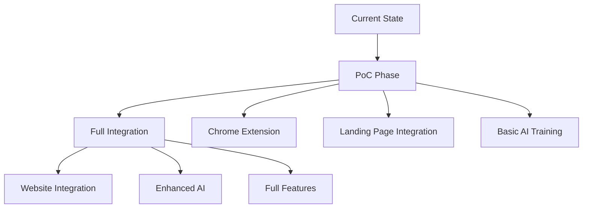
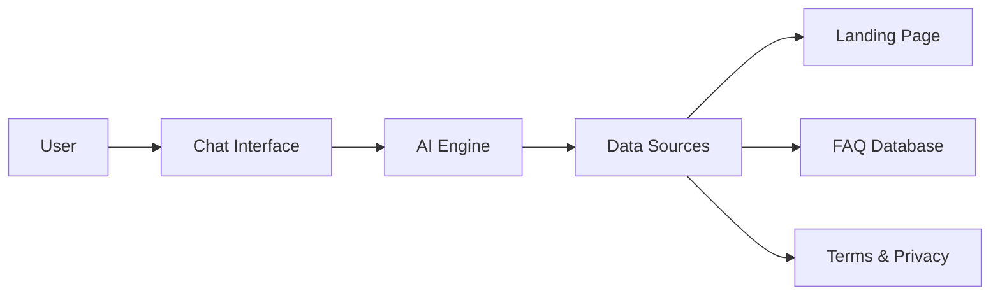
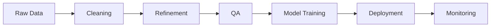
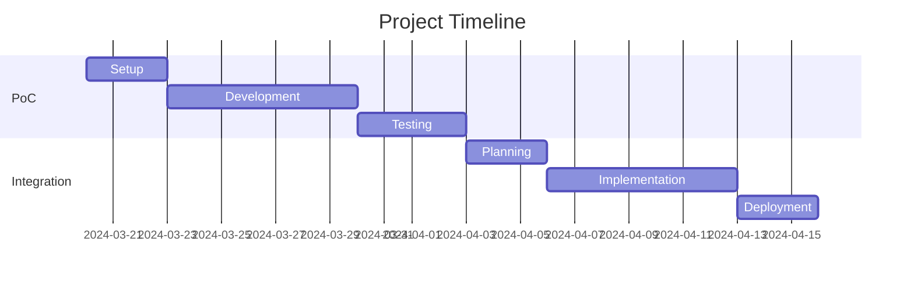

# LoyaBuzz AI Assistant
## Intelligent Customer Support Solution

  

---

## 🎯 Project Overview

---

## 🔄 Value Proposition: Why Custom AI vs Generic Chatbots?

### Generic Chatbots ($10/month)
- ❌ No integration with LoyaBuzz's unique data
- ❌ Generic responses not aligned with your business
- ❌ No understanding of cashback/loyalty mechanics
- ❌ Limited customization options
- ❌ No access to your business logic
- ❌ Monthly subscription forever

### LoyaBuzz Custom AI (One-time 1500-2000 CAD)
- ✅ Fully integrated with your website and data
- ✅ Deep understanding of LoyaBuzz's business model
- ✅ Specialized in loyalty/cashback queries
- ✅ Custom-trained on your exact offerings
- ✅ One-time cost, you own the solution
- ✅ Future-proof: can be enhanced as you grow

### ROI Comparison
- Generic chatbot: $120/year ongoing cost
- Custom AI: $1500-2000 one-time investment
  - Breaks even in ~1-2 years
  - Provides significantly better customer experience
  - Grows with your business
  - No ongoing subscription fees

---

## 🔄 Implementation Phases

### Phase 1: Proof of Concept
- 🚀 **Quick Testing Environment**
  - Chrome extension deployment
  - Landing page integration
  - Basic functionality validation

### Phase 2: Full Integration
- 🌐 **Website Integration**
  - Native chat widget
  - Seamless user experience
  - Enhanced features

---

## 🛠 Technical Architecture

---

## 📊 Data Processing Pipeline

---

## 💡 Features & Benefits

### Current PoC
- ⚡ Quick deployment
- 🤖 Basic AI responses
- 📱 Simple integration

### Future Implementation
- 🌟 Advanced AI
- 🔄 Real-time learning
- 🎯 Personalization

---

## 💰 Investment & ROI

### Investment
- 💲 PoC Development: 1500-2000 CAD
- ⏱️ Timeline: 2-3 weeks

### Returns
- 📈 24/7 Support
- 💹 Cost Reduction
- 🎯 Better Customer Experience

---

## 🎮 Demo & Screenshots

  
  
<em>AI Assistant Chat Interface</em>

---

## 📅 Timeline

---

## 📞 Next Steps

1. Agreement Finalization
2. Data Collection
3. Development Start
4. Testing & Refinement
5. Deployment
6. Ongoing Support 